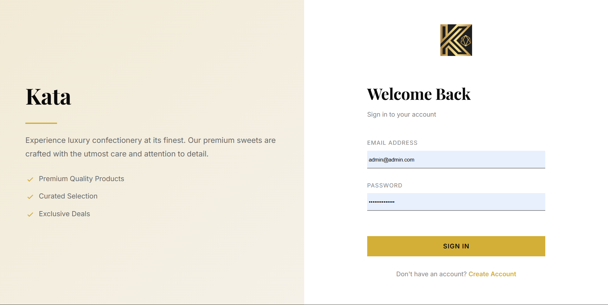
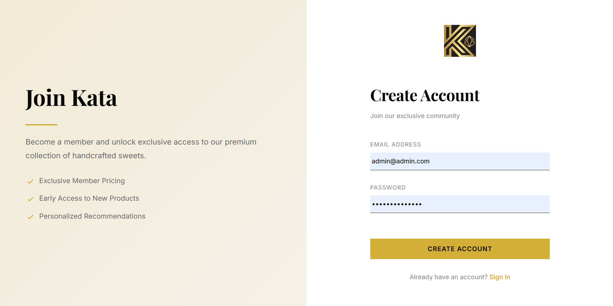
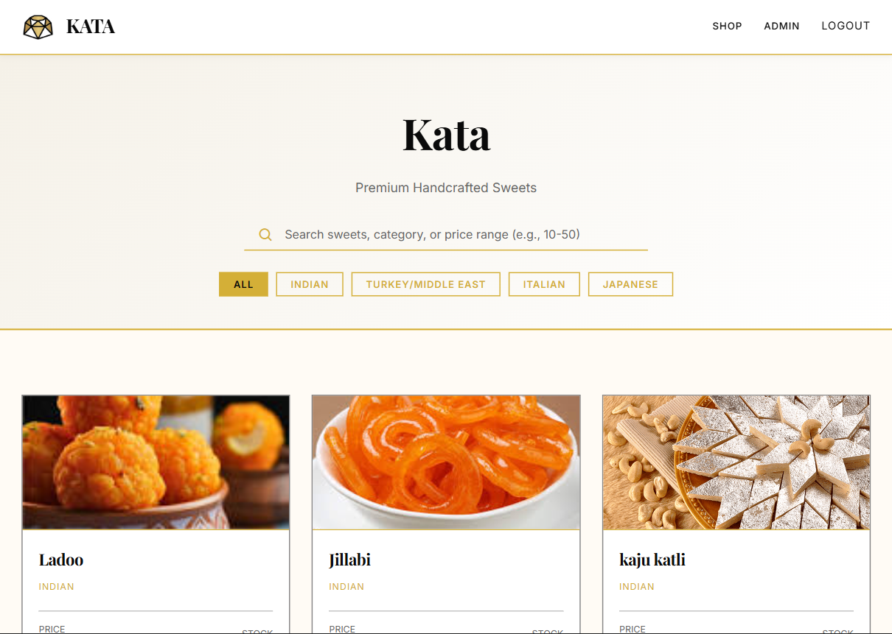
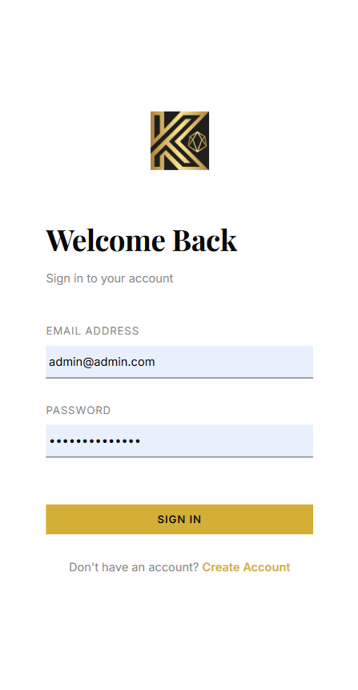
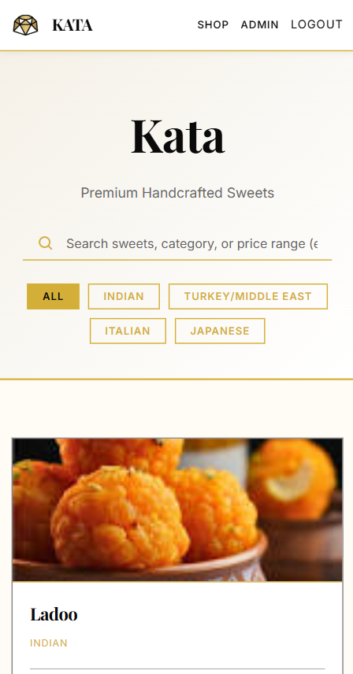
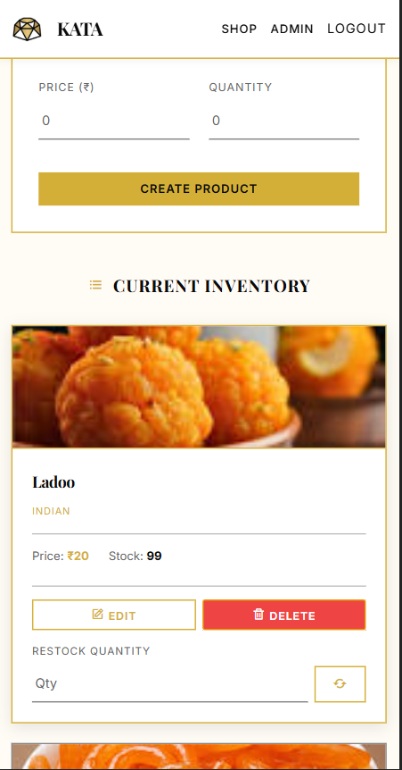

# 🍬 Sweet Shop Management System 

## 🌐 Live Demo
**[Visit Kata Sweet Shop →](https://kata-sweet.vercel.app/)**

---

## 📌 Project Overview

This project is a **Full-Stack Sweet Shop Management System** built as part of a **Test-Driven Development (TDD) Kata**. The application features a modern React frontend and a robust RESTful API backend that manages users, authentication, sweets inventory, and purchasing workflows.

The system includes both **customer-facing shopping features** and an **admin dashboard** for inventory management, with role-based access control and comprehensive testing.

---

## 🛠 Tech Stack

### Frontend
* **Framework:** React 19
* **Build Tool:** Vite
* **Routing:** React Router DOM v7
* **HTTP Client:** Axios
* **Styling:** CSS Modules
* **Deployment:** Vercel

### Backend
* **Runtime:** Node.js
* **Language:** TypeScript
* **Framework:** Express.js
* **Database:** MongoDB (Mongoose ODM)
* **Authentication:** JWT (JSON Web Tokens)
* **Testing:** Jest + Supertest
* **Dev Tools:** Nodemon, ts-node

---
## 📸 Application Screenshots PC

### 🔐 Authentication 



### 🍬 Sweets Listing


### 🛠️ Admin Dashboard


## 📸 Application Screenshots Mobile

### 🔐 Authentication 

 

### 🍬 Sweets Listing


### 🛠️ Admin Dashboard



---
### Admin Credentials
```
Email: admin@admin.com
Password: secretPassword
```


---
## 🔐 Authentication & Roles

* Users can **register** and **log in**
* Authentication is handled using **JWT**
* Two roles exist:

  * `USER` – default role
  * `ADMIN` – required for inventory management (create, update, delete, restock)

Admin users are enforced via middleware.

---

## 📚 API Endpoints

### 🔑 Auth

| Method | Endpoint             | Description           |
| ------ | -------------------- | --------------------- |
| POST   | `/api/auth/register` | Register a new user   |
| POST   | `/api/auth/login`    | Login and receive JWT |

---

### 🍭 Sweets (Protected)

| Method | Endpoint             | Access | Description                                  |
| ------ | -------------------- | ------ | -------------------------------------------- |
| POST   | `/api/sweets`        | Admin  | Create a new sweet                           |
| GET    | `/api/sweets`        | Auth   | Get all sweets                               |
| GET    | `/api/sweets/search` | Auth   | Search sweets by name, category, price range |
| PUT    | `/api/sweets/:id`    | Admin  | Update sweet details                         |
| DELETE | `/api/sweets/:id`    | Admin  | Delete a sweet                               |

---

### 📦 Inventory (Protected)

| Method | Endpoint                   | Access | Description                          |
| ------ | -------------------------- | ------ | ------------------------------------ |
| POST   | `/api/sweets/:id/purchase` | User   | Purchase a sweet (decrease quantity) |
| POST   | `/api/sweets/:id/restock`  | Admin  | Restock a sweet (increase quantity)  |

---

## 🧪 Testing Strategy (TDD)

This project strictly follows **Test-Driven Development**:

1. Write failing tests first (Red)
2. Implement logic to pass tests (Green)
3. Refactor while keeping tests green (Refactor)

### Test Coverage Includes:

* Auth (register & login)
* Role-based access control
* Sweet CRUD operations
* Inventory purchase & restock
* Search functionality

Tests are written using **Jest** and **Supertest**.

---

## ⚙️ Setup & Run Locally

### Prerequisites
- Node.js (v16 or higher)
- MongoDB (local or MongoDB Atlas)
- npm or yarn

### 1️⃣ Clone the repository

```bash
git clone <repo-url>
cd sweet-shop
```

### 2️⃣ Backend Setup

#### Navigate to server directory
```bash
cd server
```

#### Install dependencies
```bash
npm install
```

#### Environment Variables

Create a `.env` file in the server directory:

```env
MONGO_URI=<your-mongodb-connection-string>
JWT_SECRET=your_jwt_secret
PORT=3000
```

#### Run the backend server

```bash
npm run dev
```

The backend will run on `http://localhost:3000`

#### Run backend tests

```bash
npm test
```

### 3️⃣ Frontend Setup

#### Navigate to client directory
```bash
cd client
```

#### Install dependencies
```bash
npm install
```

#### Environment Variables (Optional)

Create a `.env` file in the client directory if needed:

```env
VITE_API_URL=http://localhost:3000
```

#### Run the frontend development server

```bash
npm run dev
```

The frontend will run on `http://localhost:5173`

#### Build for production

```bash
npm run build
```

---

## 🚀 Features

### For Customers
* Browse available sweets with search functionality
* View sweet details including name, category, price, and quantity
* Purchase sweets (automatically updates inventory)
* Secure authentication and user registration

### For Admins
* Full inventory management dashboard
* Create, update, and delete sweets
* Restock inventory items
* View and manage all sweets in the system

---

## 📊 Test Report

All backend features are fully covered by automated tests.

* ✅ Auth tests
* ✅ Sweet CRUD tests
* ✅ Inventory purchase & restock tests

Run `npm test` to view results.

---

## 🤖 My AI Usage

### Tools Used

* **ChatGPT**

### How I Used AI

* Brainstormed API structure and endpoint design
* Generated initial test cases for controllers
* Helped debug Jest, Mongoose, and JWT-related issues
* Assisted in refining TDD workflow and test isolation

### Reflection

AI significantly accelerated development by acting as a pair programmer. However, all logic was carefully reviewed, adapted, and integrated manually to ensure correctness, understanding, and ownership of the code.

--- 

## 🧪 Test Report

All backend features are covered by automated tests written using Jest and Supertest.

### Test Summary

- Test Suites: 8 passed, 8 total
- Tests: 10 passed, 10 total
- Snapshots: 0
- Test Runtime: ~15 seconds

Tests cover:
- User registration & login
- JWT authentication
- Role-based authorization (Admin vs User)
- Sweet CRUD operations
- Search functionality
- Inventory purchase & restock logic

All tests pass successfully.
## 🧪 Test Report

All backend features are fully covered by automated tests written using **Jest** and **Supertest** following Test-Driven Development (TDD).

### How to Run Tests

From the project root:

```bash
cd server
npm test
```


test result ::
```bash
Test Suites: 9 passed, 9 total
Tests:       11 passed, 11 total
Snapshots:   0 total
Time:        ~18 seconds
Ran all test suites.
```